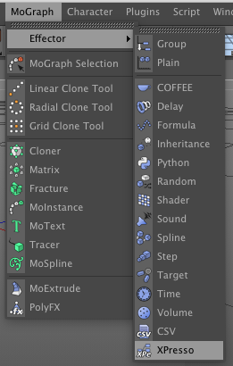

# XPresso & CSV Effector for Cinema 4D

This plugin is a prototype that I developed back in 2013. I am too busy with
other stuff to make it a commercial plugin so I am releasing the (old & bad) source
code to the public under Apache License v2.
Please let me know of any problems or suggestions via the [Issues][] page.

To understand how the plugin works, check the files in the "examples" folder!

__Features__

- MoGraph XPresso Effector - drive clones via XPresso
- MoGraph CSV Effector - drive clones with data from a CSV file
- CSV XPresso Node - read CSV files from XPresso
- MoData Node - read/write clone data from XPresso (only inside XPresso Effector)

You can find the Effectors in the "MoGraph > Effectors" menu.

 

-----

Copyright (C) 2013-2015 Niklas Rosenstein

[Issuese]: https://github.com/nr-plugins/xpresso-effector/issues
